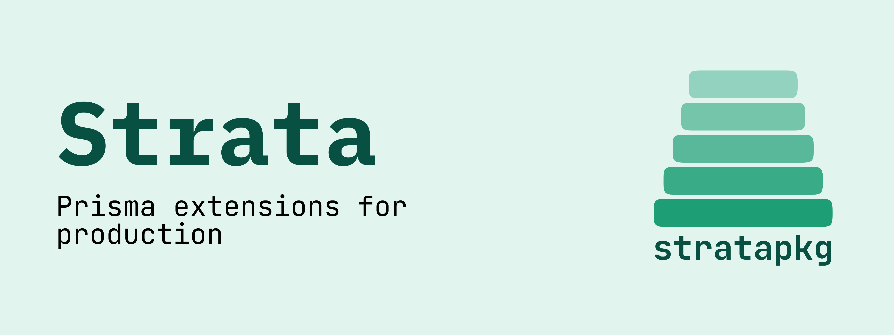

<a href="#">
	<picture>
		<source media="(prefers-color-scheme: dark)" srcset="../brand/GitHubBannerDark.png">
		
	</picture>
</a>
 

  

## What is stratapkg?

stratapkg is a collection of Prisma extensions that add production-grade capabilities to your existing ORM setup — without touching your schema, without replacing your client, without getting in the way.

Each package is an independent layer: install only what you need. Spatial queries, caching, S3-compatible file storage, audit logging — each one slots in as a thin stratum on top of Prisma, composable with the rest.

The name comes from *strata* — geological layers. The idea is the same: capabilities stack cleanly, each one distinct, each one load-bearing.

## Packages

| Package | Description | Status |
|---------|-------------|--------|
| [`@stratapkg/spatial`](https://github.com/stratapkg/spatial) | PostGIS spatial queries via CTE-based query builder | 🚧 WIP |
| [`@stratapkg/cache`](https://github.com/stratapkg/cache) | Query result caching with pluggable backends | 🚧 WIP |
| [`@stratapkg/blob`](https://github.com/stratapkg/blob) | S3-compatible file storage extension | 🚧 WIP |
| [`@stratapkg/chronicle`](https://github.com/stratapkg/chronicle) | Audit log — who changed what and when | 🚧 WIP |
| [`@stratapkg/i18n`](https://github.com/stratapkg/i18n) | Database-backed translations with runtime sync | 🚧 WIP |

## Why not just Prisma middleware?

Prisma middleware covers request/response interception, but it doesn't give you typed query builders, schema-aware storage abstractions, or structured audit trails. stratapkg packages are built specifically around Prisma's extension API — they know your models, respect your types, and compose with each other.

## Contributing

The project is in early development. If you work with Prisma and have opinions about what's missing — open an issue or start a discussion.

[Contributing](../CONTRIBUTING.md)

## License

[MIT](../LICENSE)
